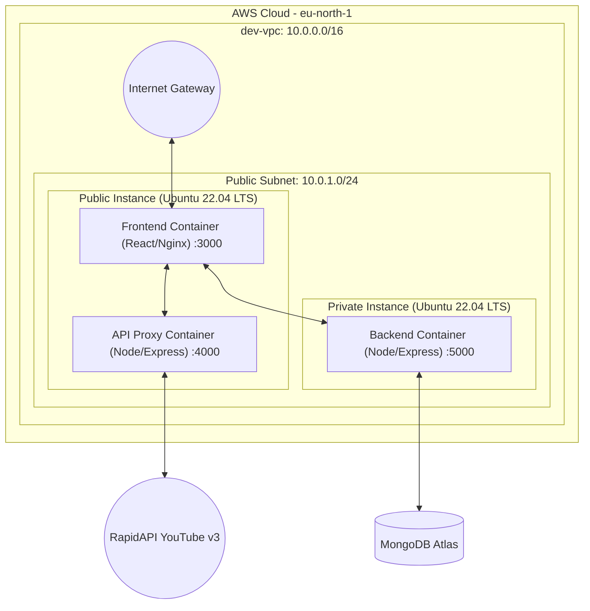

# YouTube Clone: Full-Stack Cloud-Native Application

This repository contains a full-stack YouTube Clone application architected for the cloud. It features a modern user interface, robust proxy handling for external APIs, a dedicated backend for user data, and a fully automated deployment pipeline using Docker, Terraform, and GitHub Actions.

## 🌟 Key Details & Plus Points of the Project

* **Microservices Architecture:** The project is decoupled into three independent, containerized services (Frontend, Backend, and API Proxy), ensuring scalability, easier debugging, and independent deployment cycles.
* **Highly Secure API Proxy:** Instead of making RapidAPI calls directly from the frontend (which exposes secret API keys to the browser), all YouTube v3 data requests are routed through a dedicated Node.js/Express proxy container.
* **Distroless Docker Images:** Uses `gcr.io/distroless/nodejs22-debian12` and `cgr.dev/chainguard/nginx` as base images for runtime containers. This radically reduces the attack surface area and creates extremely lightweight container sizes compared to standard Node/Nginx images.
* **Infrastructure as Code (IaC):** The entire AWS environment (VPCs, EC2 instances, Security Groups, Subnets) is defined using Terraform. This enables reproducible and version-controlled infrastructure environments.
* **Zero Trust Backend Networking:** The backend server runs with a strictly configured AWS Security Group that completely blocks inbound internet traffic, only accepting API connections from the frontend/proxy subnet.
* **Automated CI/CD Pipeline:** A `deploy.yml` GitHub Actions workflow automates the build, push (to Docker Hub), and deployment (via Terraform Apply) whenever changes are approved, achieving a true Continuous Deployment setup.
* **SPA Routing Fallback:** The Nginx proxy is perfectly configured with `try_files` to support React Router natively, preventing 404 errors on direct navigation while intelligently caching static assets.

---

## 🏗️ System Architecture

The application is hosted on Amazon Web Services (AWS) using a VPC configuration with granular networking and security controls.



### Components:
1. **Frontend (React.js + Tailwind + Material UI):** Served statically via Nginx. Handles user UI/UX, routing, and media playback.
2. **API Proxy (Node.js + Express):** Injects secret API credentials server-side and forwards proxy requests to RapidAPI.
3. **Backend (Node.js + Express + MongoDB):** Manages user authentication (JWT) and personal user data (Notes/History).

---

## ☁️ How We Migrated the Website to the Cloud

The transition from a local development environment to a cloud-native AWS production environment was achieved through several strategic phases:

### 1. Containerization (Docker)
*   **Dockerfiles:** We wrote multi-stage Dockerfiles for the `frontend`, `backend`, and `api-proxy`.
*   **Distroless Runtimes:** The build stage compiles the app (e.g., `react-scripts build` or `npm ci --omit=dev`), but the final runtime image copies *only* the compiled artifacts into a distroless image, omitting OS shells and package managers.
*   **Local Testing:** Validated the container network locally using `docker-compose.yml`, which mimics the production topology using Docker's internal DNS routing.

### 2. Infrastructure as Code (Terraform)
*   **Network Setup:** Created a VPC (`dev-vpc`) equipped with an Internet Gateway and proper CIDR block subnets (`10.0.1.0/24`).
*   **Security Groups:** Established stringent inbound/outbound rules. The `Public SG` allows ports 80/443/3000/4000 for user access, whereas the `Private SG` only permits port 5000 traffic arriving specifically from the Public Subnet's IP range.
*   **Compute Provisioning:** Migrated from local machines to Ubuntu 22.04 EC2 instances. Configured `user_data` scripts in Terraform to auto-install Docker and spin up our pulled images natively on boot.

### 3. Nginx Reverse Proxy Configuration
*   To enable dynamic container environments, Nginx was configured with an `nginx.conf` file handling SPA routing (`try_files $uri $uri/ /index.html;`) and caching.
*   Instead of hardcoding APIs, Terraform dynamically retrieves the internal AWS IP addresses of our EC2 instances and injects them as environment variables (`BACKEND_URL`, `API_PROXY_URL`) so the frontend accurately points to the backend.

### 4. Continuous Deployment (GitHub Actions)
*   Instead of manually SSHing into servers, we built an automated CI/CD pipeline (`.github/workflows/deploy.yml`).
*   **Build & Push:** The pipeline logs into Docker Hub, builds the newly committed frontend, backend, and proxy images, and pushes them tagged with the commit SHA.
*   **Deploy:** A parallel job triggers `terraform plan` and `terraform apply`, which updates the EC2 instance deployment gracefully pointing to the newly generated Docker image tags.

---

## 🚀 Running Locally

If you wish to run the stack locally for development:

1. Ensure Docker and Docker Compose are installed.
2. Create `.env` files in `backend/` (with `MONGO_URI`) and `api-proxy/` (with `RAPIDAPI_KEY` and `RAPIDAPI_HOST`).
3. Run the following command at the root of the project:
   ```bash
   docker-compose up --build
   ```
4. Access the frontend at `http://localhost:3000`.
