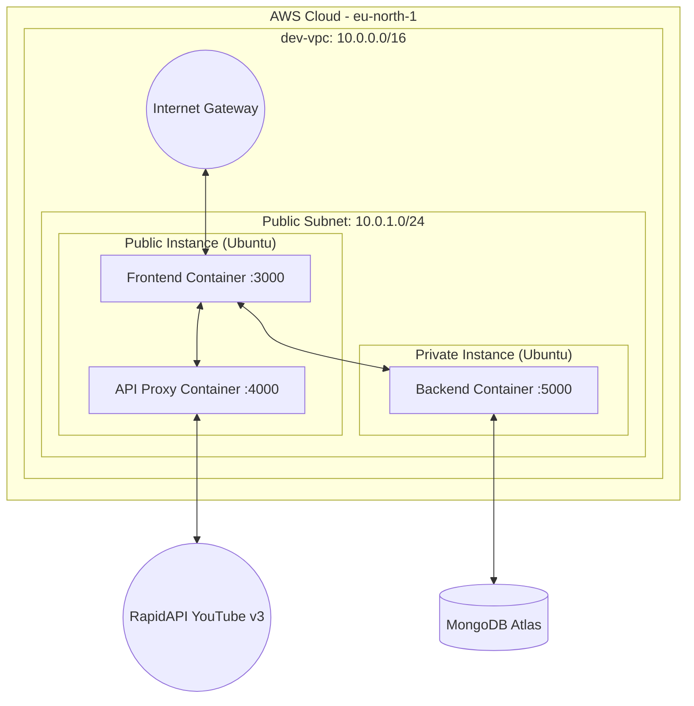

# YouTube Clone: Cloud Architecture Document

This document provides a comprehensive overview of the cloud architecture and deployment strategy for the YouTube Clone application. It details the AWS infrastructure provisioned via Terraform, the containerized application components, networking, security, and traffic flows.

## 1. High-Level Overview

The application is deployed on Amazon Web Services (AWS) using a containerized microservices approach. The infrastructure is provisioned as Code (IaC) using Terraform. It consists of three primary components packaged as Docker containers:
1. **Frontend**: A React application served via Nginx.
2. **API Proxy**: A Node.js/Express service that proxies requests to the RapidAPI YouTube v3 endpoint.
3. **Backend**: A Node.js/Express REST API that connects to MongoDB Atlas for user and application data.

These components are distributed across two Ubuntu 22.04 LTS EC2 instances (referred to logically as the "Public" and "Private" instances) within a Virtual Private Cloud (VPC).

---

## 2. Architecture Diagram

---

## 3. Infrastructure & Networking Details

The infrastructure is built to support a scalable and secure development environment (`dev`). 

### VPC and Subnets
- **VPC (`dev-vpc`)**: Uses the CIDR block `10.0.0.0/16`.
- **Public Subnet (`dev-public-subnet`)**: Uses the CIDR block `10.0.1.0/24`. Instances launched here automatically receive public IP addresses. It routes outbound internet traffic (`0.0.0.0/0`) through an Internet Gateway (IGW).
- **Private Subnet (`dev-private-subnet`)**: Uses CIDR `10.0.2.0/24`. (Currently provisioned, but reserved for future use requiring NAT Gateways).

### Security Groups
The architecture enforces strict network boundaries using AWS Security Groups:

- **Public Security Group (`dev-public-sg`)**: 
  - Attached to the Public Instance.
  - Allows inbound traffic from anywhere (`0.0.0.0/0`) on ports `80` (HTTP), `443` (HTTPS), `22` (SSH), `3000` (Frontend), and `4000` (API Proxy).
  - Allows all outbound traffic.

- **Private Security Group (`dev-private-sg`)**:
  - Attached to the Private (Backend) Instance.
  - **Zero Trust configuration**: It blocks all inbound traffic from the public internet. It *only* allows inbound traffic on port `5000` (Backend API) and port `22` (SSH) originating from the `10.0.1.0/24` CIDR block (the Public Subnet).
  - Allows all outbound traffic to connect to MongoDB Atlas and pull Docker images.

---

## 4. EC2 Instances & Container Topology

Both instances run **Ubuntu 22.04 LTS**. During provisioning, Terraform injects a `user_data` script that automatically installs Docker (`apt-get install -y docker.io`) and launches the respective containers.

### A. The "Public" Instance (Web Server & Proxy)
This instance acts as the main entry point for users. It runs two containers:

1. **Frontend Container (`krishsoh/youtube-frontend`)**:
   - Maps host port `3000` to container port `8080`.
   - Uses Nginx as a reverse proxy and static file server.
   - Inject environment variables pointing to the API Proxy (`http://172.17.0.1:4000`) and the Backend (`http://<private_ip>:5000`).

2. **API Proxy Container (`krishsoh/youtube-api-proxy`)**:
   - Maps host port `4000` to container port `4000`.
   - Injects RapidAPI keys securely.
   - Provides a local `/api/youtube/*` endpoint to bypass CORS and securely hold the API keys.

### B. The "Private" Instance (Backend API)
Although logically treated as a private backend, this instance is deployed in the Public Subnet to allow outbound internet access for downloading Docker images (avoiding NAT Gateway costs). However, its **Security Group completely isolates it from the Internet**.

1. **Backend Container (`krishsoh/youtube-backend`)**:
   - Maps host port `5000` to container port `5000`.
   - Connects to MongoDB Atlas using a connection string injected via environment variables.

---

## 5. Traffic Flow & Request Lifecycle

When a user interacts with the application, traffic follows these specific routes:

### 1. Serving the Frontend UI
1. User navigates to `http://<Public_Instance_IP>:3000`.
2. The traffic hits the AWS Internet Gateway and is routed to the Public Instance.
3. The Public Security Group allows port 3000, passing traffic to the Frontend Container.
4. Nginx serves the compiled React `index.html` and static assets (JS, CSS).

### 2. Requesting YouTube Data
1. The React app triggers a fetch for YouTube data at `/api/youtube/search`.
2. **Nginx Interception**: Nginx intercepts the `/api/youtube/` path.
3. **Internal Routing**: Nginx proxies the request to `${API_PROXY_URL}` (which evaluates to `http://172.17.0.1:4000`, the Docker Bridge IP accessing port 4000 on the same host).
4. **Proxy Fetch**: The API Proxy container receives the request, attaches the secret RapidAPI keys to the headers, and securely forwards the request to the RapidAPI YouTube v3 endpoint over the internet.
5. The JSON response flows back down the chain to the client.

### 3. Requesting Database/Auth Data (Backend)
1. The React app triggers a fetch for user data at `/api/auto` or `/api/note`.
2. **Nginx Interception**: Nginx intercepts the `/api/` path.
3. **Internal Routing**: Nginx proxies the request to `${BACKEND_URL}` (which evaluates to `http://<Private_Instance_Private_IP>:5000`).
4. **Subnet Traffic**: The traffic leaves the Public Instance and travels within the AWS `10.0.1.0/24` subnet directly to the Private Instance's private IP.
5. **Security Validation**: The Private SG verifies the traffic is coming from the `10.0.1.0/24` subnet and allows it.
6. The Backend Container processes the request, communicating securely with MongoDB Atlas over the internet.

---

## 6. Key Design Decisions & Optimizations

- **Dynamic Environment Variables in Nginx**: By using `nginx:alpine` and an `nginx.conf.template`, the frontend image is environment-agnostic. Terraform provisions the private IPs, and injects them directly into the Docker Run command, which Nginx dynamically substitutes into the config on container boot.
- **Cost-Optimized Private Tier**: True private subnets require a NAT Gateway ($30+/month). By placing the backend instance in the public subnet but locking down its Security Group to internal VPC traffic only, the architecture achieves a high level of security while avoiding NAT Gateway costs.
- **Docker Bridge Networking**: The frontend communicates with the API proxy via the default Docker bridge IP (`172.17.0.1`). This ensures the traffic never leaves the host instance, keeping latency at sub-millisecond levels and improving security.
