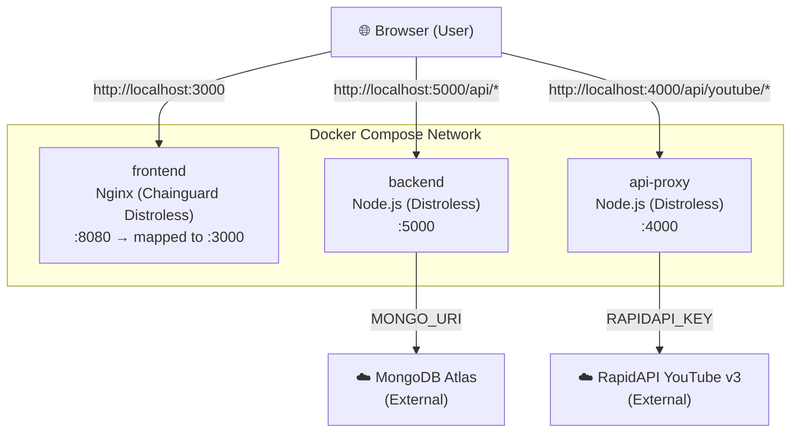
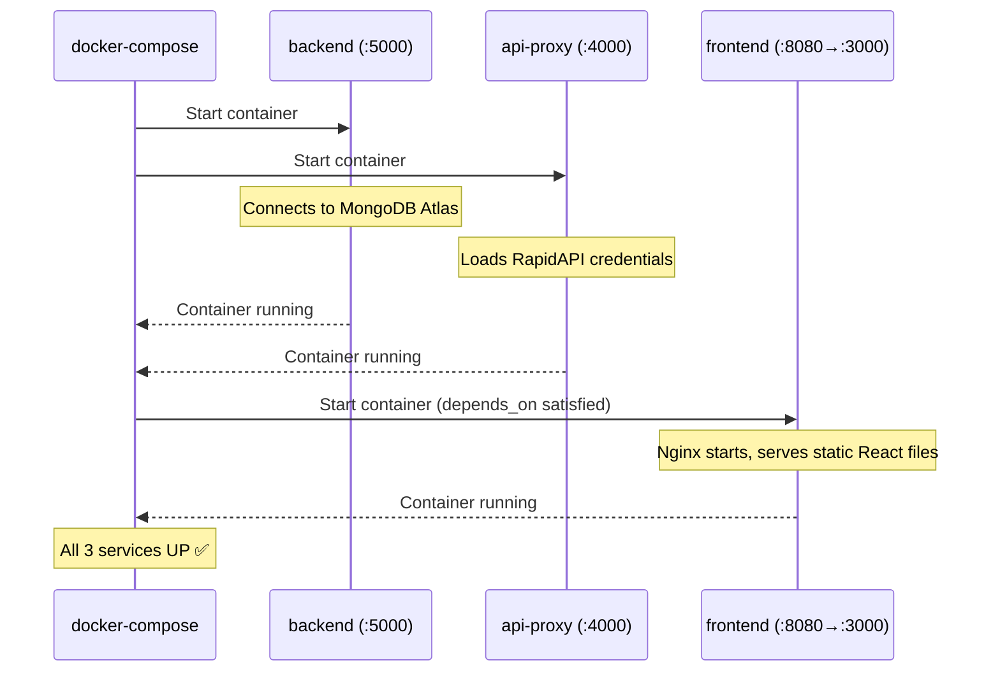
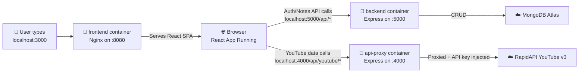

# `docker-compose up` — Full Workflow Breakdown

## Architecture Overview



---

## Step-by-Step: What Happens on `docker-compose up`

### Step 1 — Docker Compose reads [docker-compose.yml](file:///c:/react%20project/youtube2/docker-compose.yml)

Docker Compose parses the file and identifies **3 services**:

| Service | Build Context | Exposed Port | Depends On |
|---|---|---|---|
| `frontend` | `./frontend` | `3000 → 8080` | `backend`, `api-proxy` |
| `backend` | `./backend` | `5000 → 5000` | — |
| `api-proxy` | `./api-proxy` | `4000 → 4000` | — |

> [!IMPORTANT]
> Because `frontend` has `depends_on: [backend, api-proxy]`, Docker ensures **backend** and **api-proxy** containers are started *before* the frontend container. However, `depends_on` only waits for the container to *start*, NOT for the app inside to be *ready*.

---

### Step 2 — Build the `backend` service

Dockerfile: [backend/Dockerfile](file:///c:/react%20project/youtube2/backend/Dockerfile)

```
Stage 1 (builder) — node:22-slim
├── COPY package*.json
├── RUN npm ci --omit=dev       ← installs only production deps
└── COPY . .                    ← copies index.js, db.js, routes/, models/, middlewear/

Stage 2 (runtime) — gcr.io/distroless/nodejs22-debian12
├── COPY --from=builder /app    ← copies the entire built app
├── EXPOSE 5000
└── CMD ["index.js"]            ← starts the Express server
```

**At runtime**, [backend/index.js](file:///c:/react%20project/youtube2/backend/index.js) does:
1. Loads env vars from `./backend/.env` (containing `MONGO_URI`, etc.)
2. Connects to **MongoDB Atlas** via `db.js`
3. Starts an Express server on **port 5000**
4. Mounts two route groups:
   - `/api/note` → Notes CRUD operations
   - `/api/auto` → Auth (signup/login)
5. Enables CORS for cross-origin requests

---

### Step 3 — Build the `api-proxy` service

Dockerfile: [api-proxy/Dockerfile](file:///c:/react%20project/youtube2/api-proxy/Dockerfile)

```
Stage 1 (builder) — node:22-slim
├── COPY package*.json
├── RUN npm ci --omit=dev
└── COPY . .

Stage 2 (runtime) — gcr.io/distroless/nodejs22-debian12
├── COPY --from=builder /app
├── EXPOSE 4000
└── CMD ["index.js"]
```

**At runtime**, [api-proxy/index.js](file:///c:/react%20project/youtube2/api-proxy/index.js) does:
1. Loads env vars from `./api-proxy/.env` (containing `RAPIDAPI_KEY`, `RAPIDAPI_HOST`)
2. Starts an Express server on **port 4000**
3. Exposes a single catch-all proxy endpoint:
   - `GET /api/youtube/*` → Forwards the request to **RapidAPI YouTube v3**, injecting the API key server-side
4. This keeps the RapidAPI key hidden from the browser (security best practice)

---

### Step 4 — Build the `frontend` service

Dockerfile: [frontend/Dockerfile](file:///c:/react%20project/youtube2/frontend/Dockerfile)

```
Stage 1 (builder) — node:22-slim
├── COPY package*.json
├── RUN npm ci                  ← installs ALL deps (including devDeps for build)
├── COPY . .
└── RUN npm run build           ← runs "react-scripts build" → produces /app/build/

Stage 2 (runtime) — cgr.dev/chainguard/nginx:latest  (Distroless Nginx)
├── COPY --from=builder /app/build → /usr/share/nginx/html   ← static React files
├── COPY nginx.conf → /etc/nginx/conf.d/default.conf         ← custom Nginx config
└── EXPOSE 8080
```

> [!NOTE]
> The frontend is a **fully static React build**. There is no Node.js runtime in production — only Nginx serving HTML/CSS/JS files.

---

### Step 5 — Containers Start (Startup Order)



---

### Step 6 — Networking

Docker Compose creates a **shared bridge network** automatically. All three containers can reach each other by service name:

| From | To | Address |
|---|---|---|
| Host machine | frontend | `http://localhost:3000` |
| Host machine | backend | `http://localhost:5000` |
| Host machine | api-proxy | `http://localhost:4000` |
| frontend container | backend | `http://backend:5000` |
| frontend container | api-proxy | `http://api-proxy:4000` |

> [!WARNING]
> The React app runs **in the user's browser**, not inside the frontend container. So the browser calls `localhost:5000` and `localhost:4000` directly — it cannot use Docker's internal DNS names like `backend:5000`. That's why all three ports are exposed to the host.

---

## 🔍 Deep Dive: What Does `nginx.conf` Do?

File: [frontend/nginx.conf](file:///c:/react%20project/youtube2/frontend/nginx.conf)

```nginx
server {
    listen 8080;
    server_name localhost;
    root /usr/share/nginx/html;
    index index.html;

    # SPA fallback
    location / {
        try_files $uri $uri/ /index.html;
    }

    # Cache static assets
    location ~* \.(js|css|png|jpg|jpeg|gif|ico|svg|woff|woff2|ttf|map|webp)$ {
        expires 1y;
        add_header Cache-Control "public, immutable";
    }

    # No cache for index.html
    location = /index.html {
        add_header Cache-Control "no-cache, no-store, must-revalidate";
    }
}
```

Nginx has **3 jobs** in this project:

### Job 1 — Static File Server
```
root /usr/share/nginx/html;
```
Serves the compiled React build files (JS bundles, CSS, images, `index.html`) from the directory where the Dockerfile copied them.

### Job 2 — SPA Fallback (React Router Support) ⭐ Most Important
```
location / {
    try_files $uri $uri/ /index.html;
}
```

This is **critical** for any Single Page Application. Here's why:

| Scenario | Without `try_files` | With `try_files` |
|---|---|---|
| User visits `/` | ✅ Serves `index.html` | ✅ Serves `index.html` |
| User visits `/channel/123` | ❌ **404 Not Found** (no file at that path) | ✅ Serves `index.html`, React Router handles the route client-side |
| User refreshes on `/video/abc` | ❌ **404 Not Found** | ✅ Serves `index.html`, React Router picks up the URL |

**How `try_files` works step by step:**
1. Browser requests `/channel/123`
2. Nginx checks: does a **file** at `/usr/share/nginx/html/channel/123` exist? → **No**
3. Nginx checks: does a **directory** at `/usr/share/nginx/html/channel/123/` exist? → **No**
4. Nginx falls back to serving `/index.html` → **React app loads**
5. React Router reads the URL `/channel/123` and renders the correct component

> [!CAUTION]
> Without this rule, **every page refresh or direct URL visit would result in a 404**, because those routes only exist in React Router's JavaScript — they are not real files on disk.

### Job 3 — Smart Caching Strategy

**Static assets** (JS, CSS, images, fonts) get aggressive caching:
```nginx
expires 1y;
add_header Cache-Control "public, immutable";
```
- Browsers cache these for **1 year**
- `immutable` tells the browser: "don't even check for updates" — because React's build system hashes filenames (e.g., `main.a1b2c3d4.js`), so a new build = new filename

**`index.html`** gets **zero caching**:
```nginx
add_header Cache-Control "no-cache, no-store, must-revalidate";
```
- The browser **always** fetches a fresh `index.html`
- This ensures users get the latest JS/CSS bundle references after a new deployment

---

## Summary — Complete Request Flow



| Component | Technology | Role |
|---|---|---|
| **frontend** | React + Nginx (Chainguard distroless) | Serves the SPA, handles client-side routing |
| **backend** | Express + Node.js (distroless) | Auth & Notes API, connects to MongoDB |
| **api-proxy** | Express + Node.js (distroless) | Hides RapidAPI key, proxies YouTube API calls |
| **nginx.conf** | Nginx config | SPA fallback routing + static file caching |
